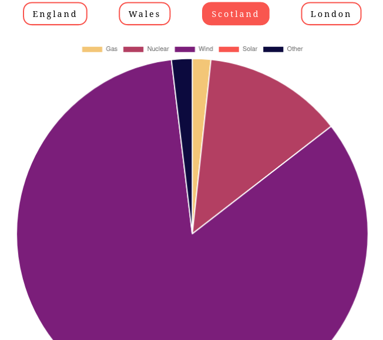

# Carbon Intensity over main UK regions

Simple project with simple techs. Shows Carbon Intencity over England, Scotland, Wales and London,
with the use of [Carbon Intensity API](https://carbon-intensity.github.io/api-definitions/#carbon-intensity-api-v2-0-0).

### Techs used
- [Alpine.js](https://alpinejs.dev/) - minimalistic JS framework
- [Chart.js](https://www.chartjs.org) - JS charting tool
- Native [JS modules](https://developer.mozilla.org/en-US/docs/Web/JavaScript/Guide/Modules)

### How it looks

### Notes
- Just simple styling were applied here. App is not responsive, was developed/tested on comparatively small screen (15" laptop)
- Local server should be used to run the app. In my case, there was a PHP local server (`php -S localhost` in the main app folder)
- Since JS modules are in use and no transpilers are on-board, only quite [fresh browsers](https://developer.mozilla.org/en-US/docs/Web/JavaScript/Guide/Modules#browser_compatibility) are needed for the app.
- The app was tested with Firefox 100

### Possible enhancements
- Cache of data received from the API with the usage of LocalStorage. It might be cached for 30 min (API data is updated every 30 min), or cache time could be based on the time gaps given in the response.
- Main script in the separate file, to clear out the main page. Somehow it didn't worked for me with `type="module"`
